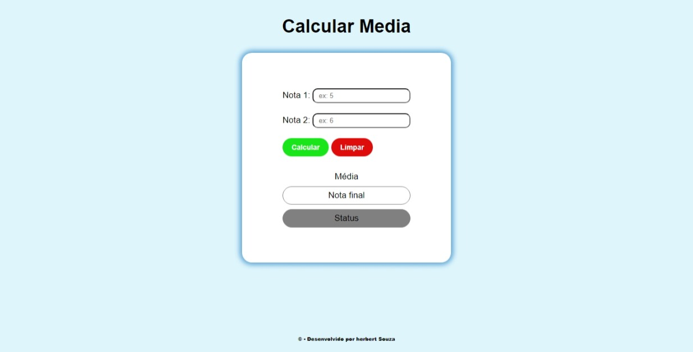
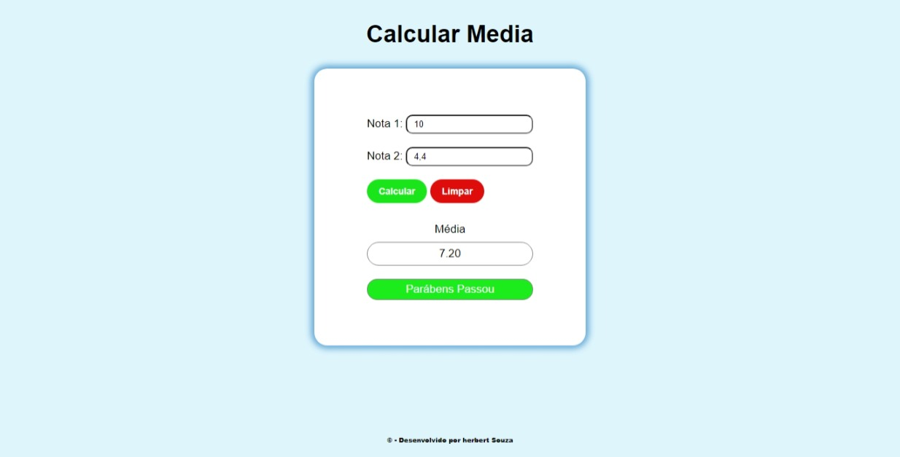
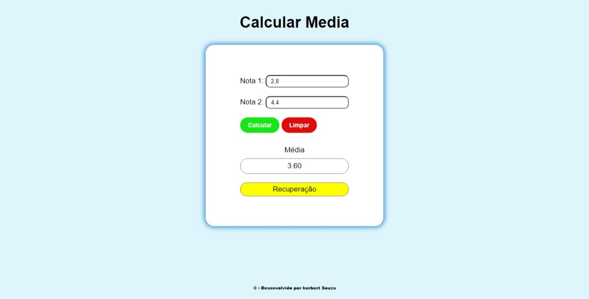
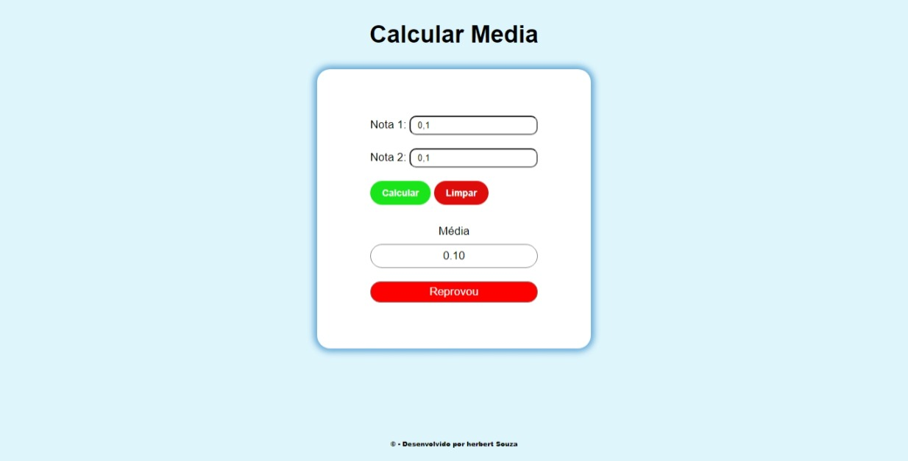
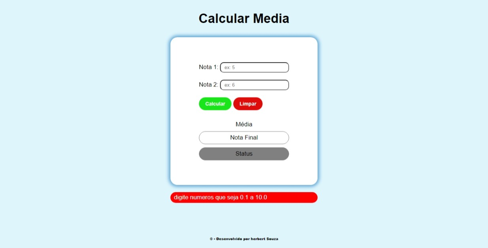

# calcular_media
 
 
site para vocês que estão querendo calcular a media dos dois primeiros bimestres esperimente garando que irar gosta e já vai se preparar para o 3 bimestre

 # como funciona

 
Basicamente é um site que calcula sua média e já diz se você passou nesses dois bimestres ou não para que você possa estudar nas férias

 

    
    
basicamente terá essa tela inicial e terá dois inputs nota 1 e nota 2 nesses dois lugares terá que digitar a nota após isso aperta em calcular para que a aplicação calcule sua media e passe seu resultado

    
    
Após aperta em calcular chegara três tipos de tela para vocês forá a tela de erro caso digite numeros invalidos ou max de 10 ou menor de 0
    
    
    
São essas três telas que dirá se você passou ou não, e terá a mensagem de erro caso tenha digitado números errados ou sejá números negativos ou números maiores de 10

    
    
Apertando o botão Limpar a tela voltarar ao normal a tela inicial
    
    
É isso obrigado por ler e ver minha evolução me seguir para ver mas minha evolução você vai ver que vai gosta dos projetos e tente você mesmo fazer um projeto engual... Mas não vale copiar e colar tente você mesmo
 

# Pode copiar

Copiar e colar não, mas pegar meu projeto de base e recriar ele do seu jeito fique a vontade somos devs temos que evoluir fique avontade e se tiver duvida me chame no linkedin ou aqui mesmo te darei todo o apoio que precisar 

